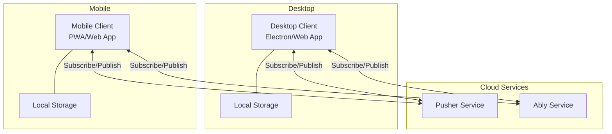

# Design Document

## Overview

跨设备消息传递系统采用客户端-服务器架构，使用 Pusher 和 Ably 作为实时消息传递的云服务。系统包含三个主要组件：

1. **桌面客户端（Desktop Client）**: 基于 Electron 或 Web 的应用，运行在 Windows 系统上
2. **移动客户端（Mobile Client）**: 基于 Web 的移动应用（PWA）或原生应用
3. **消息代理服务（Message Broker）**: Pusher 和 Ably 提供的实时通信服务

## Architecture

### System Architecture Diagram



### Communication Flow

1. 用户在任一客户端发送消息
2. 客户端通过选定的 Message Broker（Pusher 或 Ably）发布消息到共享频道
3. Message Broker 将消息推送到订阅该频道的所有其他客户端
4. 接收端客户端显示消息并存储到本地

### Technology Stack

**Desktop Client:**
- HTML/CSS/JavaScript（可选 Electron 打包为桌面应用）
- Pusher JS SDK / Ably JS SDK
- LocalStorage 用于消息持久化

**Mobile Client:**
- HTML/CSS/JavaScript（PWA）
- Pusher JS SDK / Ably JS SDK
- LocalStorage 用于消息持久化
- Service Worker 用于推送通知

**Message Brokers:**
- Pusher（主要）
- Ably（备用）

## Components and Interfaces

### 1. Message Broker Abstraction Layer

为了支持 Pusher 和 Ably 的切换，我们需要一个抽象层：

```javascript
// MessageBrokerInterface
interface IMessageBroker {
  connect(config): Promise<void>
  disconnect(): void
  subscribe(channel, callback): void
  publish(channel, message): Promise<void>
  onConnectionChange(callback): void
  getConnectionStatus(): ConnectionStatus
}

// PusherBroker implements IMessageBroker
// AblyBroker implements IMessageBroker
```

### 2. Message Manager

负责消息的发送、接收和存储：

```javascript
class MessageManager {
  constructor(broker, storage)
  
  sendMessage(content, deviceName): Promise<void>
  onMessageReceived(callback): void
  getMessageHistory(limit): Message[]
  clearHistory(): void
}
```

### 3. Storage Manager

负责本地消息持久化：

```javascript
class StorageManager {
  saveMessage(message): void
  getMessages(limit): Message[]
  clearMessages(): void
  saveConfig(config): void
  getConfig(): Config
}
```

### 4. UI Controller

负责用户界面交互：

```javascript
class UIController {
  constructor(messageManager)
  
  initialize(): void
  displayMessage(message): void
  showNotification(message): void
  updateConnectionStatus(status): void
  handleSendMessage(): void
}
```

### 5. Configuration Manager

负责应用配置：

```javascript
class ConfigManager {
  getBrokerType(): 'pusher' | 'ably'
  setBrokerType(type): void
  getDeviceName(): string
  setDeviceName(name): void
  getPusherConfig(): PusherConfig
  getAblyConfig(): AblyConfig
}
```

## Data Models

### Message Model

```javascript
interface Message {
  id: string              // 唯一标识符（UUID）
  content: string         // 消息内容
  deviceName: string      // 发送设备名称
  timestamp: number       // 时间戳（毫秒）
  direction: 'sent' | 'received'  // 消息方向
}
```

### Config Model

```javascript
interface Config {
  deviceName: string      // 设备名称
  brokerType: 'pusher' | 'ably'  // 使用的服务
  channelName: string     // 频道名称（用户唯一标识）
}
```

### Pusher Configuration

```javascript
interface PusherConfig {
  appId: '2071709'
  key: '623081937d708e9520c1'
  secret: '4093958f84d53ef4cbf3'
  cluster: 'ap1'
}
```

### Ably Configuration

```javascript
interface AblyConfig {
  apiKey: '9shR5A.xvkDJA:vM1osbX-TP_GLf2YDSc1idGvHfQn4cRNTo0KCYEUgGY'
}
```

## Detailed Component Design

### Pusher Broker Implementation

```javascript
class PusherBroker implements IMessageBroker {
  private pusher: Pusher
  private channel: Channel
  
  async connect(config) {
    this.pusher = new Pusher(config.key, {
      cluster: config.cluster
    })
    this.channel = this.pusher.subscribe(config.channelName)
  }
  
  subscribe(channelName, callback) {
    this.channel.bind('message', callback)
  }
  
  async publish(channelName, message) {
    // 使用 Pusher HTTP API 发送消息
    // 需要后端支持或使用 client events（需要启用）
  }
}
```

### Ably Broker Implementation

```javascript
class AblyBroker implements IMessageBroker {
  private ably: Ably.Realtime
  private channel: Ably.RealtimeChannel
  
  async connect(config) {
    this.ably = new Ably.Realtime(config.apiKey)
    this.channel = this.ably.channels.get(config.channelName)
  }
  
  subscribe(channelName, callback) {
    this.channel.subscribe('message', callback)
  }
  
  async publish(channelName, message) {
    await this.channel.publish('message', message)
  }
}
```

## Architecture Decisions

### 1. 使用 Ably 作为主要服务

**决策**: 优先使用 Ably 而非 Pusher

**理由**:
- Ably 的客户端可以直接发布消息，无需后端服务器
- Pusher 的免费版本需要启用 client events 才能让客户端直接发送消息
- Ably 提供更简单的 API 和更好的免费额度
- 保留 Pusher 作为备用选项

### 2. 使用频道名称作为用户标识

**决策**: 使用用户自定义的频道名称来隔离不同用户的消息

**理由**:
- 简单且有效的多用户隔离方案
- 无需复杂的用户认证系统
- 用户可以通过共享频道名称在多个设备间同步

### 3. 客户端架构选择

**决策**: 
- 桌面端：使用纯 Web 应用（HTML/CSS/JS），可选 Electron 打包
- 移动端：使用 PWA（Progressive Web App）

**理由**:
- 跨平台兼容性好
- 开发和维护成本低
- PWA 支持推送通知和离线功能
- 无需应用商店审核，部署快速

### 4. 本地存储方案

**决策**: 使用 LocalStorage 存储消息和配置

**理由**:
- 简单易用，浏览器原生支持
- 足够存储 100 条消息记录
- 无需额外的数据库依赖

## Error Handling

### Connection Errors

```javascript
// 连接失败处理
try {
  await broker.connect(config)
} catch (error) {
  // 显示错误提示
  // 5 秒后自动重试
  setTimeout(() => reconnect(), 5000)
}
```

### Message Send Errors

```javascript
// 消息发送失败处理
try {
  await messageManager.sendMessage(content, deviceName)
  showSuccessNotification()
} catch (error) {
  showErrorNotification('发送失败，请重试')
  // 保留消息内容在输入框中
}
```

### Network Disconnection

```javascript
// 监听连接状态变化
broker.onConnectionChange((status) => {
  if (status === 'disconnected') {
    showWarning('连接已断开，正在重连...')
    startReconnection()
  } else if (status === 'connected') {
    showSuccess('已重新连接')
  }
})
```

## Testing Strategy

### Unit Tests

- MessageManager 的消息发送和接收逻辑
- StorageManager 的数据持久化功能
- ConfigManager 的配置管理功能
- Broker 抽象层的实现

### Integration Tests

- 完整的消息发送和接收流程
- Pusher 和 Ably 的切换功能
- 连接断开和重连机制
- 本地存储和历史记录功能

### Manual Testing

- 在真实设备上测试桌面端和移动端的消息互通
- 测试网络波动情况下的重连机制
- 测试推送通知功能
- 测试不同浏览器的兼容性

## Security Considerations

### API Key 保护

- Ably API Key 包含在客户端代码中（这是 Ably 的标准做法）
- 使用 Ably 的 capability 限制来控制权限
- 建议为此应用创建专用的受限 API Key

### Channel 隔离

- 每个用户使用唯一的频道名称
- 频道名称应该足够复杂以防止被猜测
- 建议使用 UUID 或长随机字符串作为频道名称

### 消息内容

- 消息以明文传输（Pusher 和 Ably 使用 TLS 加密传输层）
- 不建议发送敏感信息
- 如需额外安全性，可在应用层实现端到端加密

## Deployment

### Desktop Client

1. 开发纯 Web 版本，可通过浏览器访问
2. 可选：使用 Electron 打包为独立桌面应用
3. 部署到静态网站托管服务（如 GitHub Pages, Netlify）

### Mobile Client

1. 开发 PWA 版本
2. 配置 Service Worker 和 manifest.json
3. 部署到静态网站托管服务
4. 用户通过浏览器访问并"添加到主屏幕"

### Configuration

- 将 API 密钥配置在客户端代码中
- 提供配置界面让用户设置设备名称和频道名称
- 提供服务切换选项（Pusher/Ably）

## Future Enhancements

1. 支持图片和文件传输
2. 支持消息加密
3. 支持多设备同步
4. 支持消息搜索功能
5. 支持消息分组和标签
6. 添加用户认证系统
7. 支持消息已读状态
8. 支持消息撤回功能
